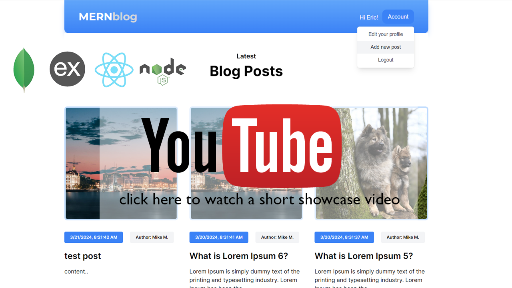

# Blog App - MERN Stack

## Introduction

This repository contains the code for a MERN (MongoDB, Express.js, React, Node.js) stack application for managing blog posts. The project is divided into two folders: `frontend` for the Vite/React frontend and `backend` for the MERN stack backend.

## Short Showcase Video

[](https://www.youtube.com/watch?v=wfQInuxTgIs)


## Stack

Frontend
- Vite
- React (react router, axios)
- Tailwind CSS
- react-hot-toast
- react-simple-wysiwyg


Backend
- Node
- Express
- Mongodb
- JWT
- Multer


## Getting Started

### Prerequisites

Make sure you have the following installed on your machine:

- [Node.js and npm](https://nodejs.org/)
- [MongoDB Atlas Account](https://www.mongodb.com/)

### Clone the Repository

```bash
git clone https://github.com/vuleta-dev/Blog-App-MERN.git
```


## Frontend Setup


Navigate to the frontend directory:

```bash
cd frontend
```


Install dependencies:

```bash
npm install
```

Run the development server:

```bash
npm run dev
```

The frontend will be accessible at http://localhost:5174/

## Backend Setup

Navigate to the backend directory:

```bash
cd backend
```

Create a .env file in the backend directory and define the following:
```bash
JWT_SECRET=<enter your JWT secret variable>
MONGO_URL=<Your MongoDB Atlas Connection String>
```

Replace <Your MongoDB Atlas Connection String> with your actual MongoDB Atlas connection string.

Install dependencies:
```bash
npm install
```

Run the development server:

```bash
npm run dev
```

The backend will be running at http://localhost:8000

Now, the Blog App should be fully functional locally.

